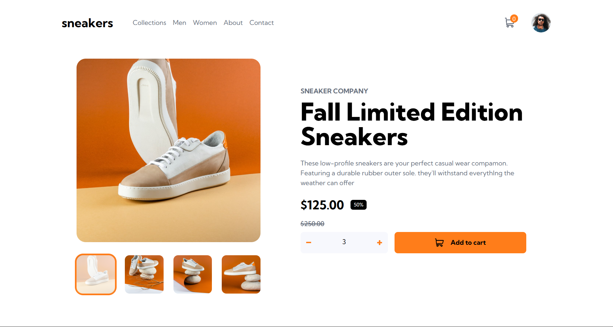

<h1 align="center" style="font-weight: bold;">Ecommerce product page main</h1>

<p align="center">
 <a href="#tech">Technologies</a> • 
 <a href="#started">Getting Started</a> • 
 <a href="#colab">Collaborators</a>
</p>

<p align="center">
    <b>Projeto proposto pelo frontendmentor.io</b>
</p>

<p align="center">
     <a href="https://ecommerce-product-page-main-three-eta.vercel.app/" target="_blank" >📱 Visit this Project</a>
</p>

<h2 id="layout">🎨 Layout</h2>

<p align="center">
    
    
    
</p>
<p align="center">
    
    
</p>
<h2 id="technologies">💻 Technologies</h2>

- React
- Typescript
- Vite
- Tailwindcss
- Zustand

<h2 id="started">🚀 Getting started</h2>

<h3>Prerequisites</h3>

- [NodeJS](https://nodejs.org/pt)
- [Git](https://git-scm.com/downloads)
- [Vscode](https://code.visualstudio.com/)

<h3>Cloning</h3>

```bash
git clone https://github.com/Coe-Everton/ecommerce-product-page-main.git
```

<h3>Starting</h3>

```bash
cd commerce-product-page-main
npm run dev
```

<h2 id="colab">🤝 Collaborators</h2>

Special thank you for all people that contributed for this project.

<table>
  <tr>
    <td align="center">
      <a href="https://github.com/Coe-Everton" target="_blank">
        <br>
        <sub>
          <b>Everton Caldeira Oliveira</b>
        </sub>
      </a>
    </td>
</table>
